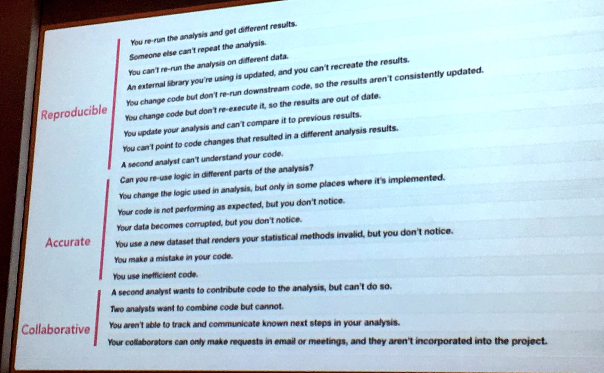

```{r setup, include=FALSE}
options(htmltools.dir.version = FALSE)
```

class: inverse, center, middle

# Short intro to reproducibility

---
class: important

## Reproducibility

> Calculation of quantitative research results by independent researchers using original data and methods

???

1. You should be able to follow the analysis path of someones results 
from data to final results and obtain numerically close* or identical values.

2. Same numeric results can be obtained from the same data using different calculation methods.

.footnote[[*] Sometimes analysis involves for example random sampling. To make 
such calculations replicable use `set.seed()`.]

---

## Levels of reproducibility

- Reproducibility can be dependent on three levels of information: __empirical, statistical, computational__*.

--

- Empirical reproducibility includes experimental details, used reagents, cell lines, instruments, instrument settings.

--

- Statistical reproducibility includes details about used statistical tests, used models, thresholds.

--

- Computational reproducibility means availability of data, code, workflows, and details of the computational environment.

.footnote[
[*] Stodden, V, McNutt, M, Bailey, DH, Deelman, E, Gil, Y, Hanson, B, Heroux, MA, Ioannidis, JP, Taufer, M (2016). Enhancing reproducibility for computational methods. Science, 354, 6317:1240-1241.
]

???

- thresholds example: We keep 1kb contigs from metagenomic assembles, but for virus identification, we use only 5b and longer contigs, since we have empirically determined that it is the minimum required by downstream viral classification
- Computational components, leading to a processed data to be statistically analysed is usually well described and documented on level of code and workflows. 
- But statistical components are usually available as a free text in articles' Results and Methods sections, which makes this part much difficult to reproduce/replicate.


---

## Minimal components of computational reproducibility

- Data, 
- Code/scripts, 
- Workflow describing how to generate the results using the data and code. 
- Parameter settings, random number seeds.


???

- If you perform your analyses using e.g. R or Python, then statistical reproducibility is also covered by availability of code.
- Examples: workflows nf-core/mag, protocols virsorter2 + checkv + dramv 


---
class: important

## Computational reproducibility facilitates replication

- More commonly, we want to replicate someone else's analysis workflow on our own data to get comparable results
- We need code, workflow, and parameters

???

We are not pursuing empirical reproducibility -- we bring our own raw data. 

However, there are lots of aspects of computational reproducibility that may not work or can go wrong.

---
class: middle

```{r, echo=FALSE, fig.align="center"}

```

<div>
<blockquote class="twitter-tweet" data-lang="en"><p lang="en" dir="ltr">&quot;We have known common problems when developing analysis&quot; here is a list by <a href="https://twitter.com/hspter">@hspter</a> and <a href="https://twitter.com/JennyBryan">@JennyBryan</a> <a href="https://twitter.com/hashtag/rstats?src=hash">#rstats</a> <a href="https://twitter.com/hashtag/EARLconf2017?src=hash">#EARLconf2017</a> <a href="https://t.co/fVjlq9Q3OF">pic.twitter.com/fVjlq9Q3OF</a></p>&mdash; Alice Data (@alice_data) <a href="https://twitter.com/alice_data/status/908244191733538816">September 14, 2017</a></blockquote> <script async src="//platform.twitter.com/widgets.js" charset="utf-8"></script>
</div>

???

Let's discuss what is behind each of these problems

1. Parts of the analysis are not deterministic. Parameters are not described sufficiently. workflow is not described sufficiently.
2. Analysis is not documented sufficently/code is not available.
3. Data is in different shape or format, missing variables.
4. Older versions of the used software/code are not available.
5. Code is broken/not self-sufficient and analysis involves some external actions not implemented in the code. (something that Ülo does alot)
6. Code should be self-sufficient and all analyses should easy to rerun. Keep track of changes in the code and tag and save versions.
7. Save results obtained with new code to a new folder or put also results under version control (if not too big, optimally less than 1 GB)
8. version control not implemented
9. code is not sufficiently documented/commented


10. Follow DRY principle -- don't repeat yourself and wrap some repetitive pieces of code/analyses into functions to reduce errors and enhance readability
11. result of not using DRY principle -- analysis logic is used inconsistently in different parts of analysis
12. Code runs without errors, but the result is incorrect. You don't run tests to assure that code produces correct/expected results, error handling not implemented.
13. You overwrite your raw data with processed data
14. everything can happen... e.g. variable data type is silently changed during import
15. insufficient regular expression can cause bias in results, because only part of the expected matches are found
16. Insufficient knowledge of coding language can lead to a convoluted code posing significant bottleneck for throughput


17. code is not publicly available
18. incompatible licences?
19. version control not implemented, code is not public
20. your collaborators are not using public code repositories, they not in the same skill level

---

#### Excerpt from a log file. What type of reproducibility problem is this?

.small-code[
```bash
2023-11-22 00:00:30,004 - Getting descriptions of hits from peptidase
2023-11-22 00:00:31,005 - Getting hits from pfam
2023-11-22 00:01:24,730 - Getting hits from dbCAN
/gpfs/space/home/taavi74/miniconda3/envs/DRAM/lib/python3.10/site-packages/mag_annotator/database_handler.py:215: UserWarning: No descriptions were found for your id's. Does this SLH look like an id from dbcan_description
  warnings.warn(
/gpfs/space/home/taavi74/miniconda3/envs/DRAM/lib/python3.10/site-packages/mag_annotator/database_handler.py:215: UserWarning: No descriptions were found for your id's. Does this GT2_Glycos_transf_2 look like an id from dbcan_description
  warnings.warn(
/gpfs/space/home/taavi74/miniconda3/envs/DRAM/lib/python3.10/site-packages/mag_annotator/database_handler.py:215: UserWarning: No descriptions were found for your id's. Does this SLH look like an id from dbcan_description
  warnings.warn(
/gpfs/space/home/taavi74/miniconda3/envs/DRAM/lib/python3.10/site-packages/mag_annotator/database_handler.py:215: UserWarning: No descriptions were found for your id's. Does this GT2_Glyco_tranf_2_3 look like an id from dbcan_description
  warnings.warn(
2023-11-22 00:01:56,057 - Getting hits from VOGDB
2023-11-22 00:28:56,241 - Merging ORF annotations
2023-11-22 00:30:17,522 - Annotations complete, processing annotations
/gpfs/space/home/taavi74/miniconda3/envs/DRAM/lib/python3.10/site-packages/mag_annotator/annotate_vgfs.py:189: SettingWithCopyWarning: 
A value is trying to be set on a copy of a slice from a DataFrame.
Try using .loc[row_indexer,col_indexer] = value instead

See the caveats in the documentation: https://pandas.pydata.org/pandas-docs/stable/user_guide/indexing.html#returning-a-view-versus-a-copy
  virsorter_genes['start_position'] = virsorter_genes['start_position'].astype(int)
/gpfs/space/home/taavi74/miniconda3/envs/DRAM/lib/python3.10/site-packages/mag_annotator/annotate_vgfs.py:190: SettingWithCopyWarning: 
A value is trying to be set on a copy of a slice from a DataFrame.
Try using .loc[row_indexer,col_indexer] = value instead

See the caveats in the documentation: https://pandas.pydata.org/pandas-docs/stable/user_guide/indexing.html#returning-a-view-versus-a-copy
  virsorter_genes['end_position'] = virsorter_genes['end_position'].astype(int)
2023-11-22 00:31:09,846 - The log file is created at results/DRAMv/MEGAHIT-group-EV01/dramv-distill/distill.log
2023-11-22 00:31:10,120 - Retrieved database locations and descriptions
2023-11-22 00:31:10,180 - Note: the fallowing id fields were not in the annotations file and are not being used: ['kegg_genes_id', 'kegg_id', 'camper_id', 'fegenie_id', 'sulfur_id', 'methyl_id'], but these are ['ko_id', 'kegg_hit', 'peptidase_family', 'cazy_best_hit', 'pfam_hits']
2023-11-22 00:31:10,180 - Determined potential amgs
2023-11-22 00:31:11,109 - Calculated viral genome statistics
2023-11-22 00:31:11,139 - No distillate information found for 0 genes.
2023-11-22 00:31:11,144 - Generated AMG summary
/gpfs/space/home/taavi74/miniconda3/envs/DRAM/lib/python3.10/site-packages/altair/utils/core.py:317: FutureWarning: iteritems is deprecated and will be removed in a future version. Use .items instead.
  for col_name, dtype in df.dtypes.iteritems():
2023-11-22 00:31:11,685 - Generated product heatmap
2023-11-22 00:31:11,685 - Completed distillation
"module purge" command filed with exit code 0.
```
]


???

- Please see warnings in the log file.
- We had our article rejected during the second round of review, because computational environment that we used to import raw data accidentally missed a library and certain types of files were not imported, suggesting that the results might be biased.
Embarrassingly, missing library was reported in my error logs, I designed these errors to be non breaking and therefore I could ignore these messages... I was fed up with the project.


---

## Code/computational reproducibility using git and GitHub

- <i class="fa fa-github fa-lg" aria-hidden="true"></i> (_GitHub_) is like a virtual playground for developers. 
- It's a web-based platform that uses <i class="fa fa-git fa-lg" aria-hidden="true"></i> for version control, allowing people to collaborate on projects. 
- Developers use it to store and manage their code, track changes, and work together on software projects. 
- It's a hub for open-source collaboration, making it easier for multiple people to contribute to and maintain code. 

<br><br>
<div class=center>


</div>

.footnote[
Source: ChatGPT3.5
]

???

Think of it as a social network for developers and their code!

---

### Key features of GitHub include

1. Version Control
2. Collaboration
3. Issue Tracking 
4. Wikis 
5. Actions 
6. Projects 
7. Gists 

.footnote[
Sources: 
- ChatGPT3.5; 
- Mine Cetinkaya-Rundel ["Teach datascience to new users"](https://github.com/mine-cetinkaya-rundel/2017-07-05-teach-ds-to-new-user)
- Bryan J. (2017) Excuse me, do you have a moment to talk about version control? PeerJ Preprints 5:e3159v2 https://doi.org/10.7287/peerj.preprints.3159v2
]

???

1. GitHub allows developers to track changes to their code, collaborate with others, and manage different versions of their software.
2.  Developers can work together on projects using GitHub's collaboration features. This includes the ability to fork repositories, submit pull requests to propose changes, and review and discuss code.
3. GitHub provides a built-in issue tracking system that allows developers to report bugs, propose new features, or discuss ideas. Issues can be assigned, labeled, and linked to specific code changes.
4. Each GitHub repository can have its wiki, which is a space for documentation and other project-related information.
5. GitHub Actions allow developers to automate workflows for building, testing, and deploying code directly from their repositories.
6. GitHub Projects provide a way to organize and manage work on a specific feature, bug fix, or any other kind of task.
7. Gists are a way to share snippets or small pieces of code with others. They can be public or private and are often used for sharing examples, troubleshooting code, or collaborating on small projects.

---

## Why <i class="fa fa-git fa-lg" aria-hidden="true"></i> version control is useful

.pull-left[
- __Version control__: lots of mistakes along the way, track history to revert back to last good code.
]

.pull-right[

```{r, echo=FALSE, fig.align="center"}
knitr::include_graphics("img/patmat1.png")
```


```{r, echo=FALSE, fig.align="center"}
knitr::include_graphics("img/patmat2.png")
```

.footnote[
_Images: Pat&Mat animation._
]

]


???

- If analysis ends up in some awful place, it's easy to roll back to last good code and restart. Given that you commit (save) your changes sufficiently often.


---

## Version control: the old way
Example of version control via name.

```{r, echo=FALSE, out.width=600}
knitr::include_graphics("img/versioncontrol-oldway.png")
```

Mastering [version control via name](http://thomasleeper.com/2017/09/my-first-project/).

???

I have seen people keeping their code in MS Word.


---

class: important

## Start your code reproducibility by creating an GitHub account

- Create a GitHub account at https://github.com
    - This will be a public account associated with your name
    - Choose a username wisely for future use
    - Don't worry about details, you can fill them later

---

### Create test repo on GitHub

- Go to <i class="fa fa-github fa-lg" aria-hidden="true"></i> (_GitHub_)
- Test repo: create a repository called e.g. `demo`
    - Give a brief and informative description
    - Choose "Public"
    - Check the box for "Initialize this repository with a README"
    - Click "Create Repository"
    
.footer[
Pushing your repo to Github using https now requires  [creating-a-personal-access-token](https://docs.github.com/en/authentication/keeping-your-account-and-data-secure/creating-a-personal-access-token)
or using Github CLI to authenticate via web browser.
]

---

## Cloning the repository

- Go to RStudio
- File -> New Project
    - Version Control: Checkout a project from a version control repository
    - Fill in the info:
         - URL: use HTTPS address
         - Create as a subdirectory of: Browse and create a new folder called e.g. `rstats2023`


---

## Merge conflicts

- On your repo GitHub website edit the README document and `Commit` it with a message describing what you did.
- Then, in RStudio also edit the README document with a different change.
     - Commit your changes
     - Try to push - you will get an error!
     - Try pulling
     - Resolve the merge conflict and then commit and push
- When collaborating over GitHub and working in teams you run into merge conflicts, and it is very important to learn how to resolve them properly.

---

## To be learned

> Remember to pull before starting to work!

--

- It's impossible to avoid shell: using RStudio interface, you can commit, push-pull, edit .gitignore file, change between branches.

--

- Creating branches must be done on GitHub, in terminal or in some other Git UI.
      - Windows users: learn how to quickly open command prompt/terminal
      - learn how to copy full path to your project folder 

--

- [RStudio](https://www.rstudio.com/products/rstudio/) has tons of features including system shell.

--

- **Discuss with your PI, supervisor when creating public repository of your research project.**

---

## More about using GitHub for version control

Bryan J. (2017) Excuse me, do you have a moment to talk about version control? PeerJ Preprints 5:e3159v2 https://doi.org/10.7287/peerj.preprints.3159v2

---

## What is RStudio project and what is GitHub repo

- [R projects](https://support.posit.co/hc/en-us/articles/200526207-Using-Projects) are standalone folders where your work lives with its own working directory, workspace, history, and source documents.

--

- RStudio project can be used with Git version control by creating local [Git repository](https://www.atlassian.com/git/tutorials/setting-up-a-repository/git-init). 
--

- GitHub is a web-based Git or version control repository and Internet hosting service. 
 
---

## Minimal structure of an data analysis project

```
project/
|- README.md         # description of contents and guide to users
|- my_analysis.Rmd   # markdown file containing analysis
|                    # writeup together with R code chunks
|
|- data/             # raw data, not changed once created 
|  +-my_data.csv     # data files in open formats, 
|                    # such as TXT, CSV, TSV etc.
|
|- scripts/          # any programmatic code
|  +-my_scripts.R    # R code used to analyse and visualise
|  +-my-analysis.Rmd # use "here" package for paths if
|                    # keeping .Rmd files under scripts
|- results/outputs/reports/  # whatever you need
```


.footer[
Marwick B, Boettiger C, Mullen L. (2017) Packaging data analytical work reproducibly using R (and friends) PeerJ Preprints 5:e3192v1 https://doi.org/10.7287/peerj.preprints.3192v1
]

---

## Use projects, never set your working directory manually

<blockquote class="twitter-tweet" data-lang="en"><p lang="en" dir="ltr">Use. Projects. — <a href="https://twitter.com/JennyBryan">@JennyBryan</a> at <a href="https://twitter.com/hashtag/EARLConf2017?src=hash">#EARLConf2017</a> <a href="https://twitter.com/hashtag/rstats?src=hash">#rstats</a> <a href="https://t.co/r4a08JhWHT">pic.twitter.com/r4a08JhWHT</a></p>&mdash; David Smith (@revodavid) <a href="https://twitter.com/revodavid/status/907897658689417217">September 13, 2017</a></blockquote> <script async src="//platform.twitter.com/widgets.js" charset="utf-8"></script>

---

## More about organising your data analysis projects


Marwick B, Boettiger C, Mullen L. (2017) Packaging data analytical work reproducibly using R (and friends) PeerJ Preprints 5:e3192v1 https://doi.org/10.7287/peerj.preprints.3192v1

---

## GitHub as internet hosting service
Let's create and publish GitHub hosted webpage for following ggplot demo, 15 min

- Go to your GitHub account and create new repository eg **`ggplotdemo`** (check **Initialize this repository with a README**).

--

- On GitHub create gh-pages branch: 
      - 'Branch: **main**' button > Switch branches/tags > *Find or create a branch* > type into textbox: **gh-pages**

--

- Set gh-pages branch as your default branch
    - '2 branches' tab > Overview > Change default branch > select **gh-pages** from menu > update
    - now you push and pull into gh-pages by default

--
- On GitHub click "Clone or download"

---
## GitHub as internet hosting service, continued

- Go to RStudio

- Clone this repo into your RStudio project "Project">"New project">"Version Control">"Git"
--

  - Create R markdown file:
  
          - File > New File > R Markdown

  - Save this file:
      - Save under name **index.Rmd** (.Rmd is automatically added)
--

- Edit at least title to eg, "ggplot2 demo"

- Knit index.Rmd into html
      - commit all files
      - push 

---

## GitHub as internet hosting service, continued

- Go to: 
    - `https://<your-github-username>.github.io/ggplotdemo`

- What to you see?

---

## You can create webpages, blogs, slidedecks with R markdown and knitr 
We come back to this later during course

- Blogs with `blogdown` https://bookdown.org/yihui/blogdown/

- HTML presentations with `xaringan` Presentation Ninja https://slides.yihui.name/xaringan

---
class: inverse, middle

- Slides are available: https://rstats-tartu.github.io/reproducibility
- <i class="fa fa-github fa-lg" aria-hidden="true"></i> [rstats-tartu/reproducibility](https://github.com/rstats-tartu/reproducibility/tree/gh-pages)

