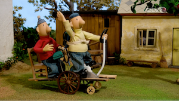
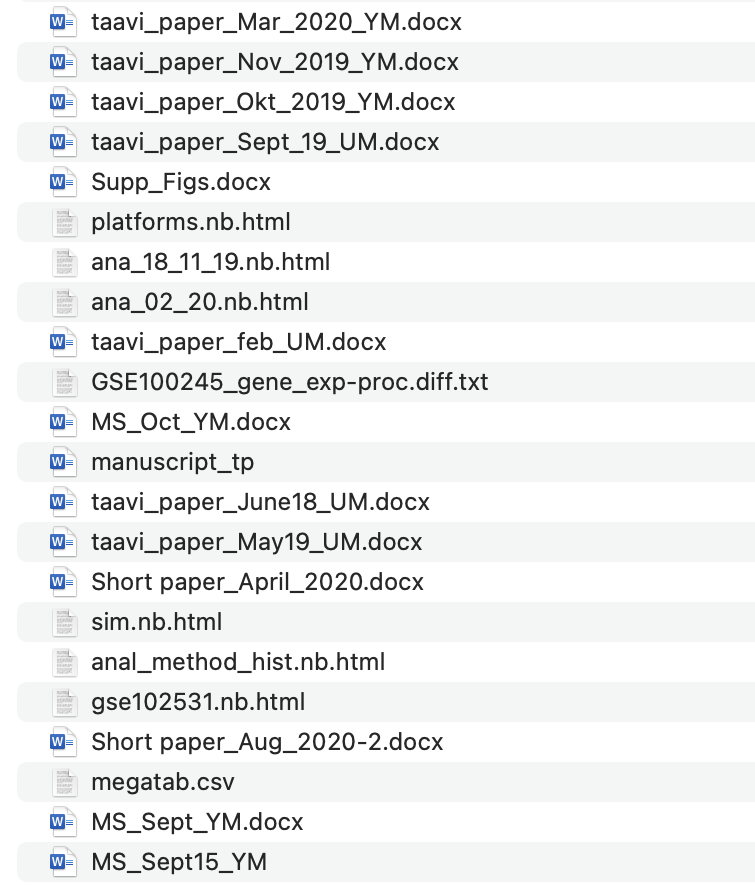

```{r setup, include=FALSE}
options(htmltools.dir.version = FALSE)
```

class: inverse, center, middle

# What is reproducibility and replicability in science?

---

## Reproducibility

> Reproducibility of research is understood as calculation of quantitative research results by independent researchers using original data and methods.

Meaning that you should be able to follow the analysis path of someones results 
from data to final results and obtain numerically close* or identical values.


Although, same numeric results can be obtained from the same data using different calculation methods.

.footnote[Sometimes analysis involves for example random sampling. To make 
such calculations replicable use `set.seed()`.]

---

## Levels of reproducibility

- Reproducibility can be dependent on three levels of information: **empirical, statistical, computational** (Stodden, 2016).
- Empirical reproducibility includes experimental details, used reagents, cell lines, instruments, instrument settings.
- Statistical reproducibility includes details about used statistical tests, used models, thresholds.
- Computational reproducibility means availability of data, details about software, workflows, and details of the computational environment.

.footnote[
Stodden, V, McNutt, M, Bailey, DH, Deelman, E, Gil, Y, Hanson, B, Heroux, MA, Ioannidis, JP, Taufer, M (2016). Enhancing reproducibility for computational methods. Science, 354, 6317:1240-1241.
]

---

## Replicability

> Replication is different from reproducibility in a sense that someones results 
can be replicated also without strictly following provided protocols. In fact, often
it's desirable to replicate other peoples results using completely different approach. 
Replication has therefore more broader scope, replication is how science works.

---

## This course is more about replicability

- Replicability improves reproducibility, but not ensures it 100%, 
- because getting the same number does not fix faults in experimental design and 
scientific question asked. 
- It's not uncommon that researchers cannot replicate their own computation results, mainly because _poor documentation of data analysis steps, leading to inadvertent errors_ in published articles, and even to retractions.

> **Minimal components** that enable independent regeneration of computational results **are the data, the computational steps (the code), and the workflow** describing how to generate the results using the data and code. Required info includes parameter settings, random number seeds, make files, or function invocation sequences (Stodden, 2016).

---
class: middle

<div>
<blockquote class="twitter-tweet" data-lang="en"><p lang="en" dir="ltr">&quot;We have known common problems when developing analysis&quot; here is a list by <a href="https://twitter.com/hspter">@hspter</a> and <a href="https://twitter.com/JennyBryan">@JennyBryan</a> <a href="https://twitter.com/hashtag/rstats?src=hash">#rstats</a> <a href="https://twitter.com/hashtag/EARLconf2017?src=hash">#EARLconf2017</a> <a href="https://t.co/fVjlq9Q3OF">pic.twitter.com/fVjlq9Q3OF</a></p>&mdash; Alice Data (@alice_data) <a href="https://twitter.com/alice_data/status/908244191733538816">September 14, 2017</a></blockquote> <script async src="//platform.twitter.com/widgets.js" charset="utf-8"></script>
</div>

---
class: middle

> This course teaches how to conduct and document data analysis and disseminate results using freely available toolset, consisting of R statistical language, R markdown and Git version control.

---
class: inverse, middle, center

# Tooling up

---

## Reproducibility toolkit

- Use of **R markdown** allows easy code and analysis annotation.
- <i class="fa fa-git fa-lg" aria-hidden="true"></i> + <i class="fa fa-github fa-lg" aria-hidden="true"></i> (_GitHub_) helps tracking progress.

<br><br>
<div class=center>


</div>

---

## Why R markdown
Reproducibility and efficiency

.pull-left[
- Code, prose and output together; syntax highlighting.
- Your only workflow is reproducible workflow.
- Consistent formatting, easier to share.
- Iterative progress, knit early an knit often.
]

.pull-right[
<br>
<div class=center>

</div>
]
---

## Why <i class="fa fa-git fa-lg" aria-hidden="true"></i> and <i class="fa fa-github fa-lg" aria-hidden="true"></i> (_GitHub_) is useful

.pull-left[
- __Version control__: lots of mistakes along the way, track history to revert back to last good code.
]

.pull-right[

```{r, echo=FALSE, fig.align="center"}

```


```{r, echo=FALSE, fig.align="center"}

```

.footnote[
_Images: Pat&Mat animation._
]

]

---

## Version control: the old way
Example of version control via name.

```{r, echo=FALSE, out.width=600}

```

Mastering [version control via name](http://thomasleeper.com/2017/09/my-first-project/).

---

## <i class="fa fa-git fa-lg" aria-hidden="true"></i> and <i class="fa fa-github fa-lg" aria-hidden="true"></i>, continued

- __Collaboration__: platform and inerface designed to enable collaboration (in software development).
- __Accountability__: transparent commit history.
- __Marketability__ and __discoverability__.
<br>
<br>
<br>

.footer[
- Source: Mine Cetinkaya-Rundel ["Teach datascience to new users"](https://github.com/mine-cetinkaya-rundel/2017-07-05-teach-ds-to-new-user)
- Bryan J. (2017) Excuse me, do you have a moment to talk about version control? PeerJ Preprints 5:e3159v2 https://doi.org/10.7287/peerj.preprints.3159v2
]

???

- Transparent commit history: Version control helps assess scientific paper or project authors contributions

---
class: inverse, middle, center

# Let's try out to connect  with 

---

## Let's start by creating an GitHub account

- Create a GitHub account at https://github.com
    - This will be a public account associated with your name
    - Choose a username wisely for future use
    - Don't worry about details, you can fill them later
- Create a repository `intro_demo`
    - Give a brief and informative description
    - Choose "Public"
    - Check the box for "Initialize this repository with a README"
    - Click "Create Repository"

---

## Cloning the repository

- Go to RStudio
- File -> New Project
    - Version Control: Checkout a project from a version control repository
    - Fill in the info:
         - URL: use HTTPS address
         - Create as a subdirectory of: Browse and create a new folder call `rstats2017`
- Note for the future: Each course component you work on will live in its own repository, and should be fully contained in a folder inside the folder `rstats2017`.

---

## Merge conflicts

- On your repo GitHub website edit the README document and `Commit` it with a message describing what you did.
- Then, in RStudio also edit the README document with a different change.
     - Commit your changes
     - Try to push - you will get an error!
     - Try pulling
     - Resolve the merge conflict and then commit and push
- When collaborating over GitHub and working in teams you run into merge conflicts, and it is very important to learn how to resolve them properly.

---

## To be learned

> Remember to pull before starting to work!

--

- Unfortunately, it's impossible to avoid shell: using RStudio interface, you can commit, push-pull, edit .gitignore file, change between branches.

--

- Creating branches must be done on GitHub, in terminal or in some other Git UI.
      - Windows users: learn how to quickly open command prompt/terminal
      - learn how to copy full path to your project folder 

--

- Currently, [RStudio Preview](https://www.rstudio.com/products/rstudio/download/preview/) developmental version includes also system shell.

--

- **Discuss with your PI, supervisor when creating public repository of your research project.**

---

## More about using GitHub for version control

Bryan J. (2017) Excuse me, do you have a moment to talk about version control? PeerJ Preprints 5:e3159v2 https://doi.org/10.7287/peerj.preprints.3159v2

---

## What is RStudio project and what is GitHub repo

- [R projects](https://support.rstudio.com/hc/en-us/articles/200526207-Using-Projects) are standalone folders where your work lives with its own working directory, workspace, history, and source documents.

--

- RStudio project can be used with Git version control by creating local [Git repository](https://www.atlassian.com/git/tutorials/setting-up-a-repository/git-init). 
--

- GitHub is a web-based Git or version control repository and Internet hosting service. 
 
---

## Folder structure of an R project

```
project/
|- DESCRIPTION       # project metadata and dependencies
|- README.md         # description of contents and guide to users
|- my_analysis.Rmd   # markdown file containing analysis
|                    # writeup together with R code chunks
|
|- data/             # raw data, not changed once created 
|  +-my_data.csv     # data files in open formats, 
|                    # such as TXT, CSV, TSV etc.
|
|- src/              # any programmatic code
|  +-my_scripts.R    # R code used to analyse and 
|                    # visualise data
|
|- lib/              # user generated functions
|  +-my_functions.R  # R code defining functions
```


.footer[
Marwick B, Boettiger C, Mullen L. (2017) Packaging data analytical work reproducibly using R (and friends) PeerJ Preprints 5:e3192v1 https://doi.org/10.7287/peerj.preprints.3192v1
]

---

## Use projects, never set your working directory manually

<blockquote class="twitter-tweet" data-lang="en"><p lang="en" dir="ltr">Use. Projects. — <a href="https://twitter.com/JennyBryan">@JennyBryan</a> at <a href="https://twitter.com/hashtag/EARLConf2017?src=hash">#EARLConf2017</a> <a href="https://twitter.com/hashtag/rstats?src=hash">#rstats</a> <a href="https://t.co/r4a08JhWHT">pic.twitter.com/r4a08JhWHT</a></p>&mdash; David Smith (@revodavid) <a href="https://twitter.com/revodavid/status/907897658689417217">September 13, 2017</a></blockquote> <script async src="//platform.twitter.com/widgets.js" charset="utf-8"></script>

---

## More about organising your data analysis projects


Marwick B, Boettiger C, Mullen L. (2017) Packaging data analytical work reproducibly using R (and friends) PeerJ Preprints 5:e3192v1 https://doi.org/10.7287/peerj.preprints.3192v1

---

## GitHub as internet hosting service
Let's create and publish GitHub hosted webpage for following ggplot demo, 15 min

- Go to your GitHub account and create new repository eg **`ggplotdemo`** (check **Initialize this repository with a README**).

--

- On GitHub create gh-pages branch: 
      - 'Branch: **master**' button > Switch branches/tags > *Find or create a branch* > type into textbox: **gh-pages**

--

- Set gh-pages branch as your default branch
    - '2 branches' tab > Overview > Change default branch > select **gh-pages** from menu > update
    - now you push and pull into gh-pages by default

--
- On GitHub click "Clone or download"

---
## GitHub as internet hosting service, continued

- Go to RStudio

- Clone this repo into your RStudio project "Project">"New project">"Version Control">"Git"
--

  - Create R markdown file:
  
          - File > New File > R Markdown

  - Save this file:
      - Save under name **index.Rmd** (.Rmd is automatically added)
--

- Edit at least title to eg, "ggplot2 demo"

- Knit index.Rmd into html
      - commit all files
      - push 

---

## GitHub as internet hosting service, continued

- Go to: 
    - `https://<your-github-username>.github.io/ggplotdemo`

- What to you see?

---

## You can create webpages, blogs, slidedecks with R markdown and knitr 
We come back to this later during course

- Blogs with `blogdown` https://bookdown.org/yihui/blogdown/

- HTML presentations with `xaringan` Presentation Ninja https://slides.yihui.name/xaringan

---
class: inverse, middle

- Slides are available: https://rstats-tartu.github.io/reproducibility
- <i class="fa fa-github fa-lg" aria-hidden="true"></i> [rstats-tartu/reproducibility](https://github.com/rstats-tartu/reproducibility/tree/gh-pages)

